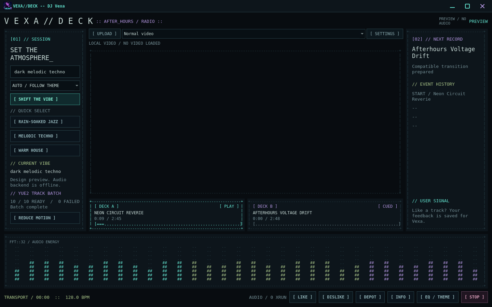
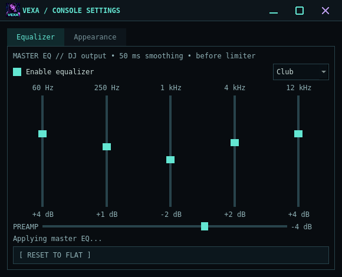
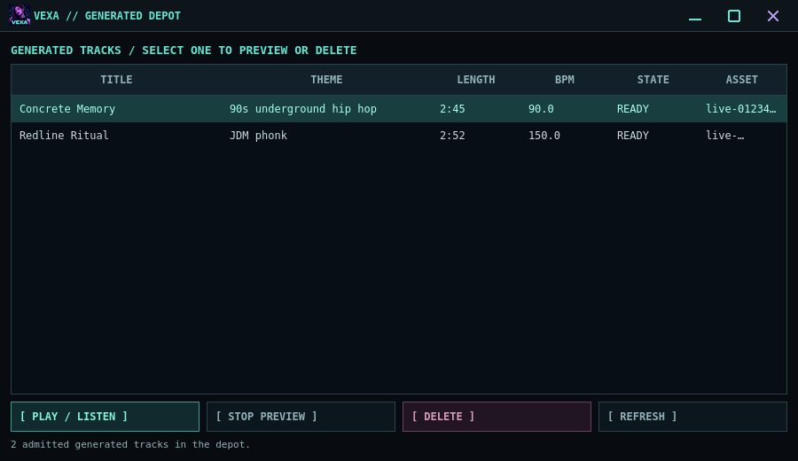
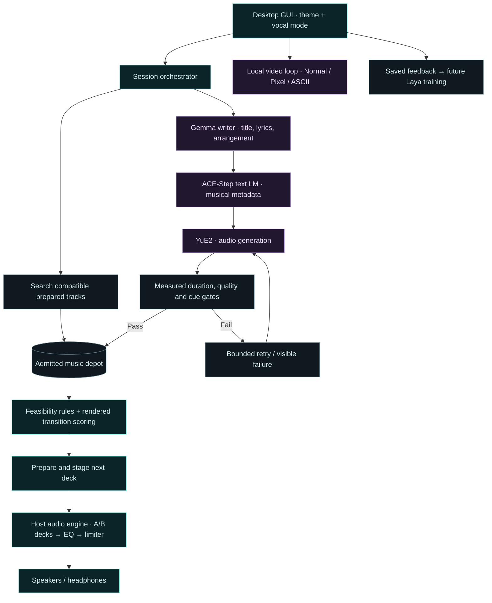
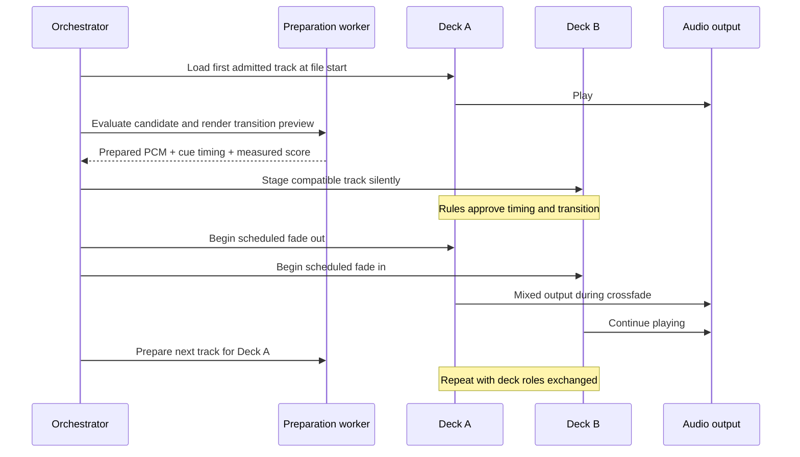

<div align="center">
  

# VEXA//DECK

**Your atmosphere. Vexa's next set.**

An open-source, AI-assisted DJ that mixes prepared music and generates themed tracks in the background.


[](LICENSE)

[Features](#-at-a-glance) · [Screenshots](#-desktop-preview) · [Architecture](#-how-a-set-is-built) · [Install](#install-on-linux--wayland) · [Develop](#development-quick-start)

</div>

VEXA//DECK is a desktop music system with a dark ASCII cyberpunk interface.
You describe an atmosphere — *"a quiet rain-soaked jazz bar"*, *"warm house
that becomes more energetic"* — and it builds a continuous set from prepared musical assets.

## 🎛️ At a glance

| | Feature | What you control |
|---|---|---|
| 🌒 | **Theme-driven sets** | Describe a genre, era or atmosphere; shift the vibe during a set. |
| 🎵 | **Local music generation** | YuE2 renders a ten-track batch with named tracks and vocal/instrumental modes. |
| 🔀 | **Continuous two-deck mixing** | Measured cues, prepared transitions and rules schedule Deck A/B. |
| 🗃️ | **Music depot** | Browse titles, listen to tracks and delete unused entries. |
| 🎚️ | **Five-band EQ** | Adjust bands, preamp and presets with smoothed changes. |
| 📺 | **Looping video** | Upload local videos; choose Normal, Pixel art or ASCII art and tune effects live. |
| 💠 | **Cyberpunk console** | Four color themes, audio spectrum, custom window controls and compact layouts. |
| 💬 | **Listener feedback** | Save likes/dislikes for future Laya training; playback currently follows rules. |

## 🖥️ Desktop preview



*Design preview with sample track data; no audio is playing. The center stays blank until you upload a video.*

<table>
  <tr>
    <th>🎚️ Master equalizer</th>
    <th>🗃️ Named music depot</th>
  </tr>
  <tr>
    <td></td>
    <td></td>
  </tr>
</table>

*EQ and depot captures use test/preview data. User videos, music and model weights are not bundled.*

## 🧩 How a set is built

### Theme → music → mix



Text planning and generation share the **RTX 5060 Ti** through a GPU lock. Generation,
analysis and transition preparation run in separate workers; the host audio callback consumes
prepared PCM. Uploaded videos stay muted. With no compatible depot track, the set waits for
its first admitted render. Failed quality/cue checks retry within the batch's attempt limit;
missing components and setup errors stop generation with a visible reason.

### Continuous deck handoff



The audio engine owns the fade clock and gain envelope. The diagram shows control events;
actual audio runs in one mixer callback. Next-track preparation continues while the current
track plays. Likes/dislikes are recorded for later training and do not change live policy yet.

## The one rule everything is built around

> Audio continuity is the highest priority. A model timeout or failed generation must not
> interrupt the stream.

Every architectural decision follows from this. Models make **bounded** decisions: the playback
engine, beat alignment, gain limits and transition deadlines stay deterministic. A selector picks
an action from a menu that has already been validated; it can never write a DSP command. If any
model is slow, dead, or wrong, the set keeps playing.

## Current state

**Host backend and Linux desktop app.** Versioned contracts, measured cue reports, theme retrieval,
YuE2 generation, rendered transition scoring, continuous two-deck playback, and a cyberpunk Qt
console with deck state and live audio spectrum.

| Component | Status |
|---|---|
| `packages/contracts` | 24 versioned schemas, JSON Schema export, invariants enforced structurally |
| `services/orchestrator` | Feasibility filter, rule policy, beat-clock scheduler, request state machine, HTTP API |
| `services/planner` | OpenAI-compatible client + local rule-based fallback |
| `services/laya` | Dataset schema, family-level splits, eval/training converters, bounded-choice adapter, RLCD fine-tune loop |
| `workers/yue2` | BS.1770-4 loudness, true peak, tempo/key/structure analysis, readiness gates |
| `services/audio` | **Two decks, crossfade, master limiter.** Runs on the host; nothing plays without it |

**The audio engine plays.** 7787 callbacks over 90 s with **zero underruns**, worst callback
0.61 ms of an 11.6 ms budget. Run `uv run --no-sync python tools/audio_smoke.py --seconds 1800`
for the full 30-minute soak.

**The Laya fine-tune pipeline is verified running on the RTX 5060 Ti.** Loss 0.9210 → 0.5409,
peak VRAM 7.81 GiB of 15.5 GiB. Those numbers came from rule-generated labels and prove the
machinery, not the quality — real labels come from A/B human review.

Phase gates, hardware allocation, and the reasoning behind each choice are in
**[`vexa-deck-docs/PLAN.md`](vexa-deck-docs/PLAN.md)**. Fine-tuning is in
**[`vexa-deck-docs/FINETUNE.md`](vexa-deck-docs/FINETUNE.md)**.

## Install on Linux / Wayland

The release is a **Linux source distribution with a per-user installer**. It installs a Python
runtime and locked dependencies, a menu entry, icons and the `vexa-deck` command. Internet access
is needed for dependency/model downloads. Music, user videos and model weights are separate.
Windows/macOS binaries and an offline AppImage are not provided in this release.

### Requirements

- Linux desktop with Wayland (X11 also supported by Qt), system audio through PortAudio,
  FFmpeg and Git. The installer manages Python 3.12 through
  [uv](https://docs.astral.sh/uv/getting-started/installation/).
- Qt Widgets, Multimedia and WebEngine: the default installer uses the tested **PySide6 6.11.2**
  wheels. [Qt's installation documentation](https://doc.qt.io/qtforpython-6/gettingstarted.html)
  describes the bundled wheels and system prerequisites. System Qt is an optional alternative.
- Local generation: NVIDIA driver, **RTX 5060 Ti / 16 GB** as the primary GPU, a CUDA toolkit
  supporting the GPU (12.8 or newer for Blackwell), C/C++ build tools, CMake, and
  [Ollama](https://ollama.com/download/linux). Leave enough disk space for the Python environment,
  approximately 14 GB of music/text weights, and your growing depot; 25+ GB free is a practical start.
  GUI/video playback and prepared audio do not require generation weights.

Print the system package command for Debian/Ubuntu, Arch or Fedora. Add `--apply` to execute it:

```bash
bash scripts/install-system-deps.sh --with-build-tools
bash scripts/install-system-deps.sh --with-build-tools --apply
```

This helper installs libraries/build tools; install the NVIDIA driver, CUDA toolkit, uv and Ollama
separately using their official instructions. It does not change GPU drivers.

### Install from a checkout or release archive

From a checkout, run the installer directly. From a release, first verify and extract the files:

```bash
sha256sum -c vexa-deck-0.1.0-linux.tar.gz.sha256
tar -xzf vexa-deck-0.1.0-linux.tar.gz
cd vexa-deck-0.1.0-linux
```

Then:

```bash
bash scripts/install.sh --dry-run   # preview paths and dependencies
bash scripts/install.sh
~/.local/bin/vexa-deck --preview   # inspect the GUI without opening audio
```

Default app location is `$XDG_DATA_HOME/vexa-deck` or `~/.local/share/vexa-deck`. The menu entry
and icons live under `$XDG_DATA_HOME`; the command uses `$XDG_BIN_HOME` or `~/.local/bin`.
Add the command directory to `PATH` if it is not already there. This is a user installation;
do not run the app installer with sudo.

Installer options:

| Option | Effect |
|---|---|
| `--prefix /absolute/path` | Use another app directory; updates require the same prefix. |
| `--data-home /path --bin-home /path` | Override shortcut/icon and command destinations. |
| `--system-qt` | Use `/usr/bin/python3` with distribution PySide6, Multimedia and WebEngine. |
| `--minimal` | Install backend/GUI without Torch and local text-planner dependencies. |
| `--skip-deps` | Copy files and install shortcuts only; no downloads. Supply runtime dependencies separately. |
| `--dry-run` | Display actions without creating files or downloading anything. |

The installer creates an empty `vexa-videos/` folder and an empty music depot. The GUI upload
picker references videos at their original paths; keeping them in `vexa-videos/` is optional.
No personal media is copied out of the checkout or included in the release.

### Enable local music generation

After installing the CUDA toolkit and Ollama, run from the installed app directory:

```bash
cd ~/.local/share/vexa-deck  # use your custom/XDG prefix if different
bash scripts/install-models.sh
.venv/bin/python tools/doctor.py --generation
~/.local/bin/vexa-deck
```

The model installer builds pinned `yue2.cpp` CUDA source and downloads only the Q8_0 backbone
and F32 VAE, then installs the ACE-Step text planner and private Gemma writer. Downloads total
multiple gigabytes and are governed by the model terms. It does not download future-work models,
Laya training weights or the optional SheetSage transcriber. YuE2 weights are CC BY-NC 4.0;
[native backend](https://github.com/ServeurpersoCom/yue2.cpp) and
[model download source](https://huggingface.co/Serveurperso/YuE2-GGUF).

Install individual components with `scripts/install-models.sh yue2`, `planner`, or `writer`.
Use `.venv/bin/python tools/install_yue2.py --dry-run` to inspect native build/download settings.
Existing YuE2 checkouts with another revision or local changes are preserved and require manual
review or a separate `--directory`. The private Ollama model cache leaves your system service intact.

The launcher reads the installed `.env` as data; explicit exported environment variables take
precedence. Set `VEXA_YUE_BINARY`, `VEXA_YUE_MODEL`, `VEXA_YUE_VAE` or `VEXA_ACE_MODEL` there to use
existing models elsewhere. After setup, enter a vibe, select the vocal mode, and start the set.
A fresh installation waits for the first admitted generated track because its depot is empty.

### Updates, diagnostics and uninstall

Run a newer extracted release's `scripts/install.sh` with the same prefix and shortcut paths.
App source is updated; `.env`, `var/`, models, generated tracks and local videos are retained.
Use the installer for updates rather than extracting release files over the installed directory.

```bash
# From the installed directory; checks do not play audio or download files:
.venv/bin/python tools/doctor.py
.venv/bin/python tools/doctor.py --generation --json
bash scripts/uninstall.sh --dry-run
bash scripts/uninstall.sh
```

For a custom install, pass `--prefix /your/app/path` to uninstall. It removes only unchanged menu,
command and icon files recorded by this installer. App files and user data remain under the
prefix so your tracks and weights can be retained; remove that directory yourself when desired.
Logs and diagnostics are in `var/logs/` and the GUI's **[ INFO ]** panel.

### Build a release

```bash
bash scripts/package.sh
# Optional reproducible timestamp:
SOURCE_DATE_EPOCH=0 bash scripts/package.sh --output dist
```

Outputs `dist/vexa-deck-0.1.0-linux.tar.gz` and its SHA-256 checksum. The archive contains source,
locked dependency metadata, Qt/video assets, installers, tests, docs and license notices, plus a
per-file inventory. It excludes `.git`, `.env`, private tool settings, virtual environments,
weights, `vexa-videos/`, generated audio, datasets and runtime state. Unexpected large source files
or symlinks fail the build. `.gitignore` and `.dockerignore` also keep those artifacts out of commits
and container contexts. `.gitignore` does not untrack files that were committed previously.

## Development quick start

```bash
uv sync --locked --extra core --extra desktop --extra local-planner
uv run --no-sync pytest
uv run --no-sync ruff check .
bash apps/desktop/run.sh
```

### Running the stack

```bash
cp .env.example .env      # every value is optional
docker compose up -d
curl localhost:8080/health
curl localhost:8081/health
```

The continuous DJ runner must run **on the host**, with access to the audio device and YuE2 model
files. The container stack still exposes the control services without host audio. The host runner
uses the same orchestrator API and starts with `VEXA_LIVE=1` by default.

### Start a continuous set on the host

```bash
uv run --no-sync python tools/extract_cues.py
VEXA_LIBRARY=assets/library uv run --no-sync python -m vexa_orchestrator
curl -X POST localhost:8000/sessions -H 'Content-Type: application/json' \
  -d '{"theme":"dark melodic techno"}'
curl localhost:8000/live
```

The runner searches admitted depot tracks for the theme and starts a compatible full-length one
immediately. The live host excludes legacy 45-second depot renders by default
(`VEXA_MIN_TRACK_DURATION_S=148`); they remain available for analysis and other tooling.
It also queues ten distinct YuE2 tracks for the entered theme, targeting 165 to 178.5 seconds.
YuE2's semantic minimum is set for each render so an early end token cannot produce a short
track. Each render must pass duration, audio quality, and cue gates before it enters the depot.
The batch retries failed renders until ten tracks are admitted or 30 attempts have been made.
If the depot has no cueable match, playback waits for the first admitted asset. `GET /live`
reports the current batch number, ready count, failures, prompt origin, and both deck states.
Playback begins at the start of the file; measured cues control the transition timing. The
next track is staged silently on the other deck before the crossfade.

By default, `VEXA_MUSIC_PLANNER=acestep` runs the local **ACE-Step 5Hz LM 1.7B** as a
music-specific text planner, paired with the existing local Ollama `gemma4:e4b` for
original theme-specific lyrics. Install it once:

```bash
uv sync --extra core --extra local-planner
.venv/bin/python tools/install_music_planner.py
.venv/bin/python tools/install_local_lyric_writer.py
```

The installer downloads only the text LM from the pinned official
[ACE-Step/Ace-Step1.5 checkpoint](https://huggingface.co/ACE-Step/Ace-Step1.5), not its
DiT/VAE/audio generator. The adapter follows the upstream inspiration prompt protocol
and uses its MIT-licensed constrained metadata decoder, since YuE2 receives **text**
conditioning. Gemma writes and validates each track separately, retrying only an invalid track rather
than regenerating the whole ten-track response. The writer stays warm during that batch
and is explicitly unloaded before ACE-Step;
The lyric writer uses a private Ollama process and `models/ollama-writer/`, so both local
models are restricted to the RTX 5060 Ti without changing the system Ollama server.
ACE-Step refines the musical caption/key with requested tempo, language, duration and
meter constrained. Original lyrics remain intact. ACE-Step alone showed weaker narrative
adherence in a real themed rap check, so it does not replace the lyric writer. It loads on
the RTX 5060 Ti in an offline worker. A cross-process GPU lock serializes text planning
and YuE2 jobs; the planner exits and releases its GPU memory before rendering starts.
Torch and Transformers never load in the interpreter that owns the audio callback.

The session's vocal selector offers **Auto / follow theme**, **No lyrics / instrumental**,
and **With vocals**. Choose it before starting or shifting the vibe. Auto understands
`no lyrics`, `without lyrics`, `no vocals`, `instrumental`, `sözsüz`, and `vokalsiz`.
Instrumental writer responses are repaired before validation: vocal-direction sentences
are removed, unwanted lyrics are cleared, and remaining instrumental details are retained.
If no instrumental details survive, the requested genre's palette and track role provide
a distinct production brief. Exact repaired/failed responses are saved under
`var/plans/raw/writer-*.json` for diagnosis. Negative lists such as “no vocals or humming”
are handled as exclusions. JDM/drift phonk has an explicit cowbell/808/drum palette.
Instrumental requests send empty lyrics to YuE2, use an instrumental arrangement, and
exclude depot tracks marked vocal or with unknown vocal intent. Depot labels record
requested generation intent; they do not certify vocal absence by audio analysis.
API callers can set `instrumental: true` (or `false` for vocals) on session creation
and theme changes; omit it to follow the theme text.

Each track gets a theme-specific narrative, original lyrics, genre/era/instrument palette,
a target tempo and key, and a bar-counted arrangement covering the requested 165–180
seconds. Rhythmic eight-bar intro/outro regions support DJ mixing. Rap plans require at
least 40 lyric lines; 1990s underground rap keeps boom bap drums and spoken MC delivery
and rejects pop/EDM drift. Explicit vocal language and BPM are checked. Trap/drill retain
their own instrument palette instead of being converted to boom bap.
ACE-Step metadata generation is bounded to 1024 tokens per attempt, since lyrics are
already written; this limits delays from a verbose metadata response.
Optional ACE-Step captions that contradict the requested genre/vocal intent are rejected
while the validated lyric writer's style is retained. Invalid local tracks get at most
three attempts, then the GUI reports the reason; there is
no silent cloud fallback. Plans are saved under `var/plans/`, raw diagnostic text under
`var/plans/raw/`, and worker logs under `var/logs/offline-plan-*.log`. Each admitted track's
`.brief.json` records its full `music_plan`, style and lyrics. Planned BPM/key/section times
are **targets**, not measurements; rendered audio still has to pass existing quality and
cue gates. Existing instrumental batches are not selected for vocal rap requests.

Set `VEXA_MUSIC_PLANNER=ollama` to use the alternative `nemotron-3-super:cloud` through
the local Ollama API (cloud access requires sign-in). `VEXA_LLM_BASE_URL`,
`VEXA_LLM_MODEL` and `VEXA_LLM_PROVIDER` configure that alternative.
`VEXA_LLM_PROVIDER=none` provides instrumental briefs without a model; vocal requests
still require a lyric writer. `VEXA_ACE_WRITER_MODEL` and `VEXA_ACE_WRITER_URL` configure the local lyric writer
(cloud models are rejected). Leaving the URL empty uses the private server with a single
GPU; an explicit URL uses the caller-managed Ollama server. `VEXA_ACE_MODEL`, `VEXA_ACE_MAX_TOKENS` and
`VEXA_ACE_TIMEOUT_S` override the local planner path, text limit and batch deadline.
`VEXA_YUE_BINARY`, `VEXA_YUE_MODEL`,
`VEXA_YUE_VAE`, and `VEXA_YUE_GPU` override the local generation paths and GPU index. With no
GPU override, the host runner chooses the RTX 5060 Ti by stable GPU UUID (the CUDA and
`nvidia-smi` index orders differ on this machine).

Use `POST /sessions/{id}/theme` with `{"theme":"..."}` to steer the set, `GET /live` to observe
the active and prepared decks, and `POST /sessions/{id}/feedback` with `{"rating":"like"}` or
`{"rating":"dislike"}` to record listener feedback for later Laya training. Feedback does not
control playback yet. `POST /live/stop` closes the host audio device.

### Linux desktop console

Use the installer above, or set up the development checkout with
`uv sync --locked --extra core --extra desktop --extra local-planner` and the model installer.
Launch the checkout with:

```bash
bash apps/desktop/run.sh
```

Install the Linux application-menu launcher and VEXA ASCII portrait icon for your user:

```bash
/usr/bin/python3 tools/install_desktop.py
```

The installer uses `XDG_DATA_HOME` (or `~/.local/share`) and adds a `VEXA//DECK` menu entry.
Its Wayland application ID is `vexa-deck`. Rerun the installer after moving the repository.

On a Wayland session, Qt uses its Wayland platform plugin. The app starts the host audio backend
locally, so the audio device and prepared depot must be available on the host. Enter a theme and
press **Start the Set**. Vexa chooses a compatible prepared track immediately when one is ready;
otherwise she waits for YuE2 generation and admission. Generation continues in the background
until ten tracks are admitted or 30 attempts have been made. The left panel shows progress,
and the live spectrum measures deck audio outside the audio callback. **Depot** lists
admitted generated tracks with Listen and Delete controls. Delete moves a track and its sidecars
into `var/trash` and rejects tracks in use by a deck. The right panel shows prepared transitions and recent moves. **Info** opens session
details and the event log; Like/Dislike and Stop remain in the footer at both window sizes.
Feedback is saved for later Laya training and does not alter live selection yet.

The launcher writes `var/logs/*-launcher.log`, the backend writes
`var/logs/*-backend.log`, and the GUI writes `var/logs/*-gui.log`. The **Info** diagnostics window shows
backend events and errors as they arrive. PortAudio output underflows are counted separately
from mixer errors and logged with callback time, device load, and generation state. Playback
uses 2048-frame callbacks with the device's high-latency buffer. CPU helper pools default to
two threads (`VEXA_CPU_THREADS`). Generation, mastering,
librosa cue analysis, decoding, tempo stretching and rendered transition scoring run in
separate low priority processes with one helper thread and two logical CPUs left available
for audio/UI. Prepared PCM is handed back as read-only memory-mapped data and touched before
deck installation. The PCM pointer, position and fade state change together at a callback
boundary. `VEXA_AUDIO_BLOCKSIZE` overrides the default 2048-frame radio buffer. YuE2 stays on
the RTX 5060 Ti. Stop/theme changes terminate generation workers and their renderer children.
Worker logs are retained in `var/logs/offline-*.log`. The master limiter uses a continuous sample
gain envelope with a 250 ms release, avoiding callback-boundary gain resets. Run
`.venv/bin/python tools/check_audio_load.py` for a quiet 14-second device check with two
background CPU workers; its measurements are saved to `var/reports/audio-cpu-load.json`.
This checks CPU contention. Run `.venv/bin/python tools/check_audio_generation.py` during
YuE2 generation for an additional device check that prepares real tracks and loads/fades
both decks; measurements are saved to `var/reports/audio-generation-load.json`. `GET /depot/tracks`,
`GET /depot/tracks/{asset_id}/audio`, and `DELETE /depot/tracks/{asset_id}` expose the same
generated depot controls over the local API.

The launcher resolves local workspace source directories from the current checkout on each
start, including after the drive changes mount paths. If a direct
`.venv/bin/python -m vexa_orchestrator` invocation reports a missing module after moving the
project, rebuild its
editable installs from the new root:

```bash
uv sync --locked --inexact --extra core --reinstall-package vexa-contracts \
  --reinstall-package vexa-audio --reinstall-package vexa-orchestrator \
  --reinstall-package vexa-planner --reinstall-package vexa-laya \
  --reinstall-package vexa-yue2-worker
```

YuE2 launches also resolve bundled GGML shared libraries from the executable’s current
folder through the subprocess environment. A moved checkout therefore does not depend on
the old absolute library paths embedded at build time. Missing components, GPU setup and
loader failures stop the generation batch immediately; audio quality rejections remain
retryable. The GUI retains the failure reason when a batch cannot finish.

Set `VEXA_API_URL=http://127.0.0.1:8000` to attach to an existing backend instead of starting a
new one. `bash apps/desktop/run.sh --preview` shows a design preview without backend or audio.
The desktop uses a dark terminal console: ASCII panel borders, installed monospace typography,
muted cyan and violet accents, a 32-band character-based spectrum and A/B progress readouts.
The center is a local looping video player that fills its allocated area, with A/B
readouts below it. The window resizes down to 720 × 700 and fits a 1080p half-screen tile.
The main window, music depot and diagnostics use a matching dark title bar with the app icon,
cyan minimize/maximize controls and a violet close control. Drag the title bar to move or tile
the window, double-click it to maximize/restore, and drag an edge or corner to resize.
The spectrum spans the console beneath the main panels; its 160-pixel strip holds nine segments
per band. At 1050 × 740 the secondary right column collapses; its next-record information stays
available in **Info**. Below 1000 pixels wide, transport status and action buttons use separate
rows. Quick-select presets hide in short windows to keep theme entry readable.
Theme entry remains a native Unicode text field.

Use **Upload** above the center panel to select one or more local videos. A single video loops;
multiple videos repeat in order. Choose **Normal video**, **Pixel art**, or **ASCII art** without
restarting the current clip. **Settings** provides:

- **Videos:** Fill/crop or Fit/full frame, effect FPS limit, pause/resume, next, remove and clear.
  Double-click a list entry to play it. Removing an entry leaves the original file on disk.
- **Pixel art:** pixel size, eleven upstream palettes plus VEXA, Bayer dithering strength,
  Sobel edge threshold/intensity and edge color.
- **ASCII art:** resolution, font size, threshold, invert, two text colors, background color,
  background gradient/saturation, randomness, brightness characters or custom text, and effect width.

The default ASCII preset matches the requested Video-to-ASCII screenshot: background
`#080c37`, background gradient enabled, saturation 60, font colors `#c7205b` / `#0032ff`,
Font Size Factor 3, Resolution 70, Threshold 30%, Invert off, Randomness 15%, Random Text,
and custom text `wavesand`. Resolution follows the upstream shorter-axis grid calculation;
Font Size Factor uses its 0–10 scale. Existing preferences receive this ASCII preset once
on upgrade; later adjustments remain saved. **Reset Styles** restores it.

Settings update live and are saved with local video paths in `var/config/video-panel.json`.
Videos are always muted; the DJ music engine remains the audio source. Reduce Motion pauses
the video; hidden/minimized windows suspend it. Fill crops to the panel aspect ratio; Fit keeps
the complete frame and may add bars. Until a video is uploaded, the center stays blank.
Old character sheets, Blender rigs and sprite animations remain removed.

The player requires PySide6 **QtWebEngineWidgets** as well as Widgets and Multimedia. It uses
bundled local code, an in-memory browser profile, and no external scripts, ads or analytics.
The pixel shader/palettes and ASCII technique derive from the two collidingScopes projects;
see [attribution](third_party/video-art/README.md). Effects default to a 24 FPS processing cap;
actual frame rate depends on hardware and video decoding. Compatibility depends on the Qt build's
codecs; H.264 MP4 and VP8 WebM were checked on this host. Concurrent YuE2/audio performance
has not been benchmarked with video effects enabled.

Check both window layouts without opening an audio device:

```bash
QT_QPA_PLATFORM=wayland /usr/bin/python3 tools/check_pixel_gui.py
QT_QPA_PLATFORM=wayland QT_SCALE_FACTOR=1.25 /usr/bin/python3 tools/check_pixel_gui.py
```

These checks verify the blank center, controls and diagnostics. Captures and reports are
written to `var/reports`.

Check video playback, the three styles, settings, muting, looping and persistence without music:

```bash
QT_QPA_PLATFORM=wayland /usr/bin/python3 tools/check_video_gui.py
# Optionally verify a real local video too:
QT_QPA_PLATFORM=wayland /usr/bin/python3 tools/check_video_gui.py --video /path/to/video.mp4
```

This check requires FFmpeg to create short temporary test videos. Its report and screenshots
are written to `var/reports/video-gui-*`.

Model weights are never bundled. They are separate downloads under their own terms — YuE2 weights
are CC BY-NC 4.0, Laya is Apache-2.0.

## Track titles

New generated tracks receive short, theme-aware titles from the prompt writer. Names appear in
Deck A/B, the next-track panel, recent moves and the depot's **TITLE** column, including preview
and delete messages. Tooltips retain the storage ID. Titles are display metadata; filenames,
content hashes, cue maps and transition decisions continue to use the same track identities.

Titles persist in the asset manifest and the generation brief. Old generated tracks receive
stable names when loaded; save those names once with:

```bash
.venv/bin/python tools/name_depot_tracks.py
```

Check title display and depot actions without playing or deleting real music:

```bash
QT_QPA_PLATFORM=offscreen /usr/bin/python3 tools/check_track_titles_gui.py
```

The naming tool updates only missing title metadata in generated track manifests. It leaves audio and cue
files untouched and preserves existing names. Missing or malformed model titles use a local
fallback, and repeated names in a set receive a short suffix. Feedback also records the title
alongside the asset ID.

## Console audio and appearance

Open **[ EQ / THEME ]** in the desktop footer:

- **Equalizer:** five master bands (60 Hz, 250 Hz, 1 kHz, 4 kHz, 12 kHz), ±12 dB,
  preamp from −12 to 0 dB, bypass, reset, and Flat / Bass lift / Warm / Clarity / Club presets.
  Presets reduce preamp to leave headroom. Changes smooth over 50 ms before the master limiter.
  This affects the live DJ mix; depot listening previews and muted videos are separate.
- **Appearance:** Vexa terminal, Neon violet, Amber terminal, or Ice blue. The console,
  spectrum, deck panels and window controls update immediately. Music vibe and video effect
  palettes remain separately configurable.

Audio preferences persist in `var/config/equalizer.json`; appearance persists in
`var/config/console.json`. EQ controls become available after the backend connects. Preview
mode changes the design without saving preferences or controlling live audio.

The backend exposes `GET /audio/equalizer` and `POST /audio/equalizer` with
`{"enabled": true, "gains_db": [4, 1, -2, 2, 4], "preamp_db": -4}`.
`GET /live` includes `audio.equalizer`, including whether an adjustment is pending. Settings
are validated and prepared outside the callback; a prewarmed compiled filter processes fixed
buffers, and rapid changes use a latest-value mailbox independent of transport commands.

Verify the settings dialog against an isolated HTTP backend (no sound), then measure live
callback timing during a crossfade and repeated EQ adjustments (speaker output muted):

```bash
QT_QPA_PLATFORM=offscreen /usr/bin/python3 tools/check_console_settings.py
.venv/bin/python tools/check_equalizer_audio.py
.venv/bin/python -m pytest tests/test_equalizer.py -q
```

Reports and screenshots are written to `var/reports/console-*` and
`var/reports/equalizer-audio-qa.json`.

## Future work: alternative local music generators

Evaluate these audio generators on the main **RTX 5060 Ti (16 GB)** before choosing another
backend. These are research candidates, not installed or integrated audio backends. The current
ACE-Step component writes planning metadata; its full audio generator is a separate future step.

| Candidate | Why evaluate it | Constraints to verify locally |
|---|---|---|
| [ACE-Step 1.5](https://github.com/ace-step/ACE-Step-1.5) | Native instrumental generation and duration/BPM/key controls; test the 2B audio models first. | Model and offload configuration determine duration and memory; benchmark on 16 GB. |
| [Stable Audio 3 Medium](https://huggingface.co/stabilityai/stable-audio-3-medium) | Music, variable duration up to 380 seconds, continuation and inpainting. | Verify Linux dependencies, GPU memory and generation speed. Published hardware measurements do not establish performance on our GPU; Small-Music's 120-second limit misses our full-track target. |
| [SongGeneration base-full](https://huggingface.co/tencent/SongGeneration/blob/main/README.md) | Up to 4½-minute songs, instrumental/BGM support and vocal/accompaniment outputs. | Upstream documents 12 GB without reference audio and 18 GB with it; verify base-full configuration, access and weight terms. Larger v2 models need more memory. |
| [DiffRhythm 1.2 full](https://github.com/ASLP-lab/DiffRhythm) | Instrumental prompting and a 285-second full model. | Test chunked decoding, full-model memory and exact 150–180-second output. The base model's 95-second mode is too short; DiffRhythm 2 instrumental support remains an upstream TODO. |
| [HeartMuLa 3B](https://github.com/HeartMuLa/heartlib) | Multilingual lyrics/tags conditioning; evaluate for vocal tracks. | The demo defaults to a 240-second generation cap. Verify memory with lazy loading and actual duration; reliable native instrumental control needs evidence. |

Implementation milestones:

1. Add interchangeable generator adapters behind the existing brief and depot admission contracts.
2. Compare 165-second instrumental phonk, underground hip-hop and techno, plus a vocal case.
   Measure genre adherence, unwanted voices, arrangement, duration, cue quality, wall time and
   peak VRAM; listen to exported results rather than judging only metadata.
3. Run generation while both decks are active. Record callback time and output underflows;
   preserve the isolated generation workers, measured cues and rule-controlled transitions.
4. Check each weight license before distribution, then select a backend from measured results.

## Documentation

### Audit the prepared music depot

The stereo analysis sidecars contain estimated chord labels, tuning, onset alignment, and spectral
fractions. They are retrieval evidence, not isolated instrument stems or verified transition cues.
Refresh them after changing audio or the extractor, then check every sidecar against its source
hash and extractor version:

```bash
uv run --no-sync python tools/extract_vibe.py
uv run --no-sync python tools/audit_analysis.py
```

The audit exits nonzero for missing, malformed, or stale reports and prints descriptor coverage.
An unknown measurement remains `null` instead of being replaced with a plausible default. Laya
does not consume these sidecars in the live orchestrator yet. The host runner uses measured cue
maps and scores actual rendered transition previews after feasibility rules filter candidates.
Tempo preparation preserves pitch and runs outside the audio callback.

```bash
uv run --no-sync python tools/evaluate_transitions.py --theme 'dark melodic techno'
```

The report and previews are written under `var/reports/`. The profile compatibility score is
included for comparison; the rendered score ranks candidates that pass the hard rules.

| Document | What it is |
|---|---|
| [PLAN.md](vexa-deck-docs/PLAN.md) | **Build order, hardware, runtime topology.** Start here |
| [PRODUCT.md](vexa-deck-docs/PRODUCT.md) | User journeys and acceptance criteria |
| [ARCHITECTURE.md](vexa-deck-docs/ARCHITECTURE.md) | Service semantics, asset model, scheduling |
| [LAYA_DATA.md](vexa-deck-docs/LAYA_DATA.md) | Dataset sources, labeling, evaluation, provenance |
| [VISUAL_DIRECTION.md](vexa-deck-docs/VISUAL_DIRECTION.md) | Dark ASCII cyberpunk GUI and local video modes |
| [IDEAS.md](vexa-deck-docs/IDEAS.md) | Experiments beyond the core |

## Licence

Source is [AGPL-3.0-or-later](LICENSE). Model weights, generated audio, and third-party datasets remain
separate artifacts governed by their own terms — see `PLAN.md` §11.
